# 交互逻辑与状态机模型

## 1. 文档定位

本文件用于回答系统中每个操作的五个核心问题：

1. 谁能操作？
2. 操作前必须满足什么状态和权限？
3. 操作成功后哪些实体改变状态？
4. 必须同时产生哪些通知、积分、日志或任务？
5. 重复、并发、失败或返回页面时如何处理？

`core-flow-design.md` 继续描述业务目标，本文件作为交互和状态迁移的细化模型。实现、API、测试和答辩图应共同引用本文件，不再各自解释状态规则。

## 2. 推荐的交互逻辑表达体系

课程要求包含用例图、类图、序列图和状态图。单独一张页面流程图无法表达权限、并发和异常，建议组合使用以下模型：

| 模型 | 回答的问题 | 本项目用途 |
| --- | --- | --- |
| 用例图 | 谁使用哪些能力 | 普通用户、拾获者、STAFF、ADMIN 的系统边界 |
| 用户旅程/页面流 | 用户从哪里进入、下一步去哪 | 发布、搜索、通知、匹配、认领、交接的入口闭环 |
| 活动图/泳道图 | 多角色和多服务如何协作 | 用户端、后端、AI、任务、管理员之间的动作顺序 |
| 序列图 | 一次请求的调用、事务和返回 | 发布后匹配、认领、双确认、举报处置 |
| 状态图 | 哪些迁移合法 | lost、found、match、claim、handover、report、cert |
| 决策表 | 多个条件如何决定结果 | 验证等级、审核动作、权限、失败降级 |
| 需求追踪矩阵 | 需求是否被设计、实现、测试覆盖 | `P0-xx -> 页面 -> API -> service -> 状态 -> 测试` |

答辩报告可以把下列 Mermaid 图导出为图片，也可以在 StarUML、ProcessOn 或 PlantUML 中重绘为正式 UML。

## 3. 用例边界

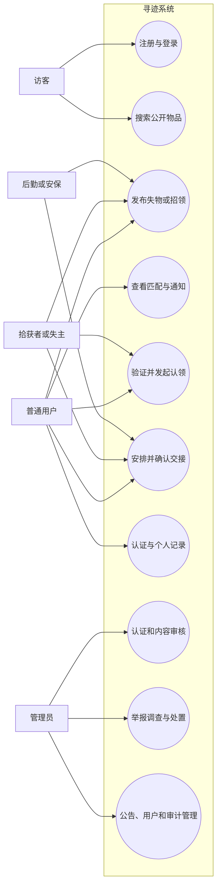

角色不是页面上的视觉标签，而是后端授权条件。ADMIN 代操作必须要求理由并记录日志；STAFF 的代管能力应使用明确的 custodian 字段，不能隐含为发布者所有权。

## 4. 核心领域关系

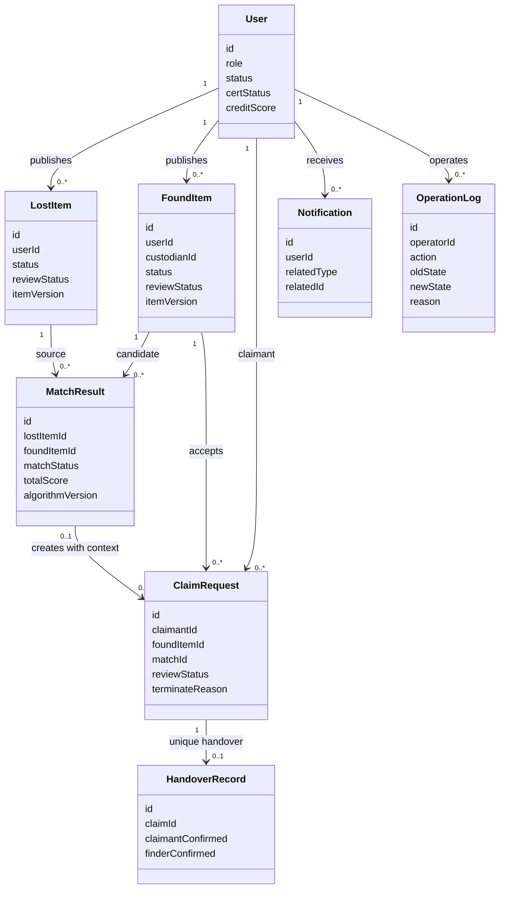

聚合边界建议：found 是认领占用的并发锁定根；claim 是审核和交接流程根；交接结案负责协调 claim、found、合法关联 lost、match、积分、通知和日志的同一事务。

## 5. 核心用户旅程

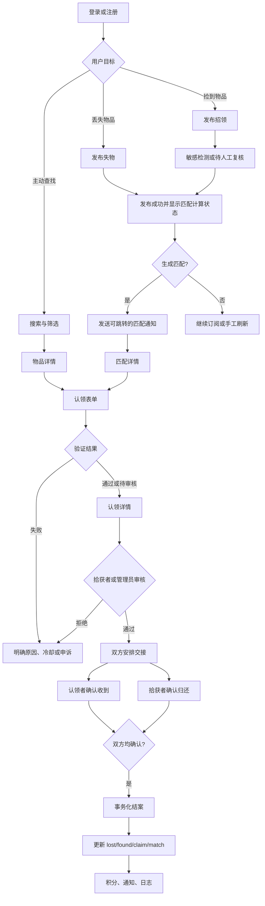

页面设计必须保证以下入口收敛到同一份上下文：搜索详情、匹配详情、通知深链、我的发布、我的认领。上下文至少包含 `bizType`、`bizId`、可选 `matchId` 和返回地址。

## 6. 发布到匹配的时序

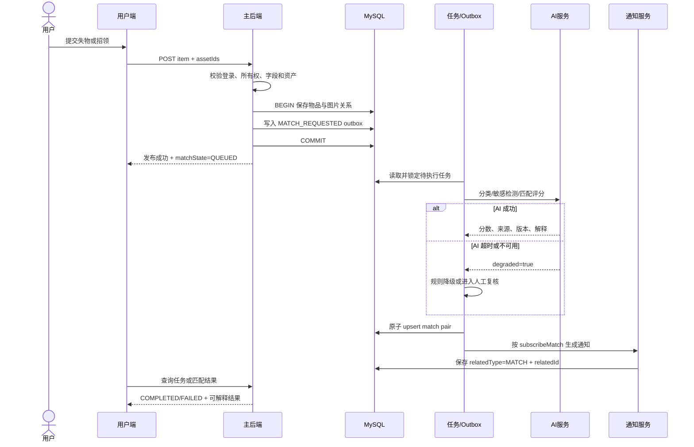

交互约束：

- 发布事务成功不等于 AI 已完成，前端必须显示 `QUEUED/RUNNING/COMPLETED/FAILED`，不能直接声称已匹配。
- AI 失败不得回滚基础发布；敏感检测失败应 fail-closed，进入待复核，不能默认“不敏感”。
- `(lost_item_id, found_item_id)` 必须唯一，重复任务只更新同一记录。
- 匹配低于阈值、物品编辑或关闭时，旧结果必须转为 `EXPIRED`。

## 7. 核心状态机

### 7.1 失物状态

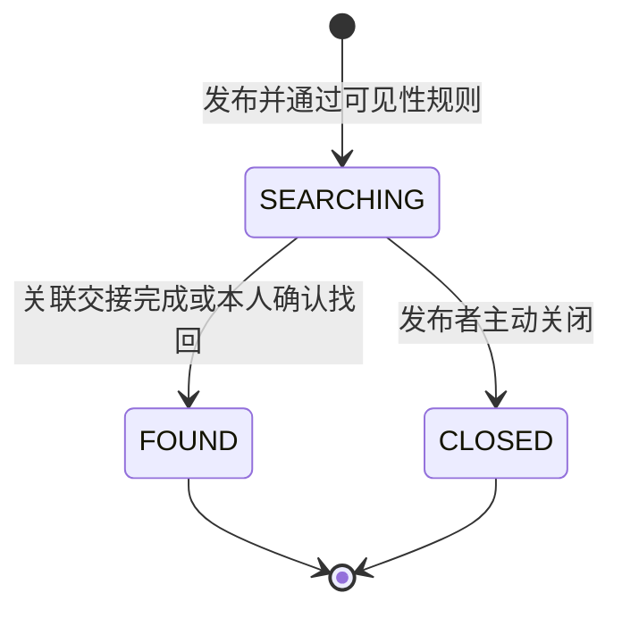

约束：

- 匹配交接导致 `FOUND` 时，当前认领人必须是关联 lost 的发布者。
- `FOUND/CLOSED` 是终态，不再生成新匹配；关联 `NEW/READ` 匹配转 `EXPIRED`。
- “删除”应是逻辑关闭或受控删除，不得留下悬空 match/notification。

### 7.2 招领状态

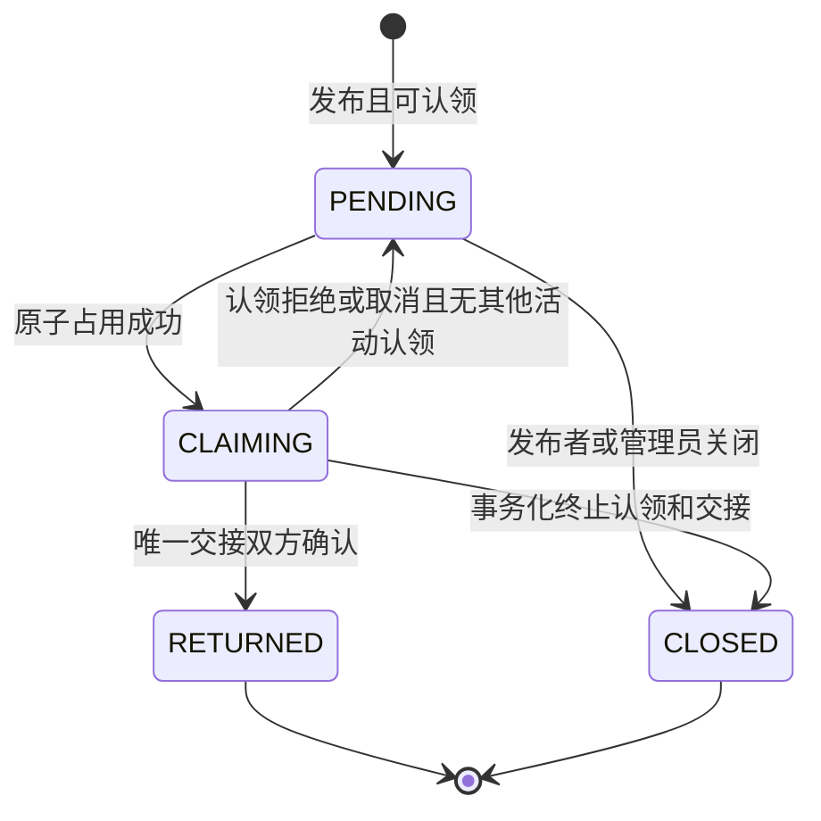

约束：

- 一个 found 同时最多一个活动认领。
- `CLAIMING -> CLOSED` 不是单表更新，必须同时终止 claim/handover、失效 match、通知双方并写日志。
- `RETURNED/CLOSED` 后禁止编辑和创建交接。

### 7.3 匹配状态

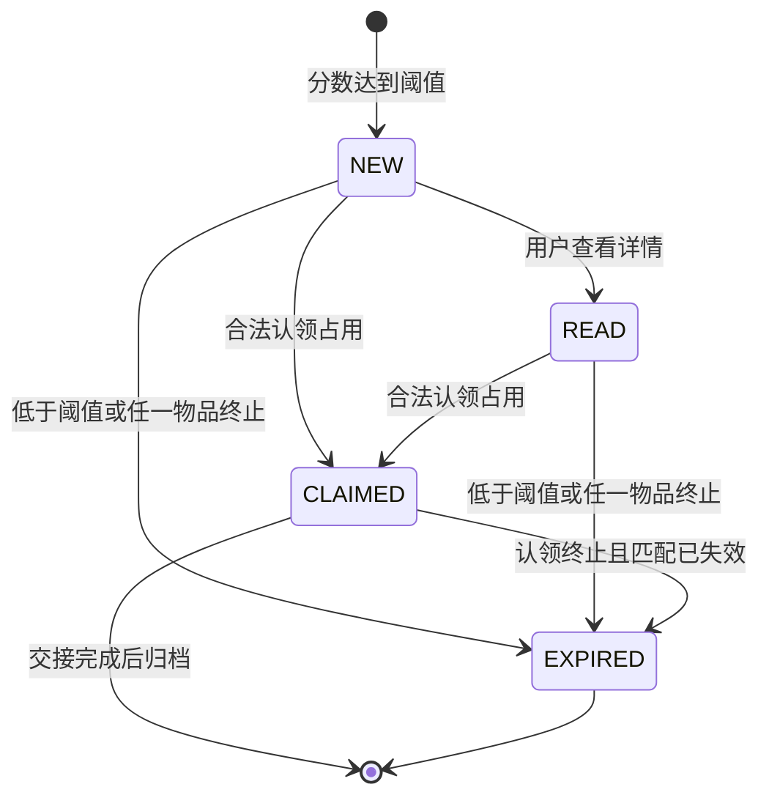

约束：只有认领进入有效处理中状态后才能置 `CLAIMED`；问答立即失败不能消耗匹配。

### 7.4 认领状态

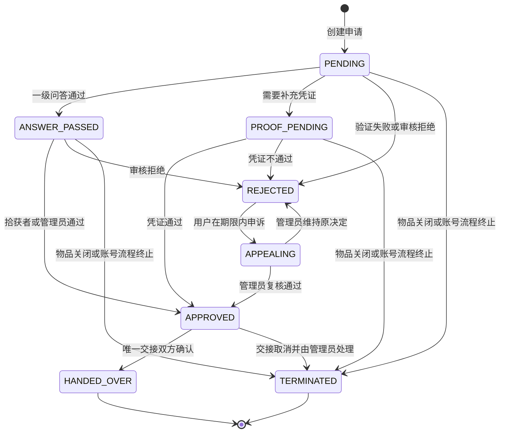

`TERMINATED` 是建议新增状态，当前枚举没有表达“不是审核拒绝，而是上游物品关闭/账号注销导致流程终止”的语义。若不新增该状态，必须另设终止字段和原因，不能滥用 `REJECTED`。

## 8. 跨聚合状态迁移表

此表应成为 service、API 和测试共同使用的验收依据。

| 动作 | 操作者 | 前置守卫 | 原子状态变化 | 必须副作用 | 冲突反馈 |
| --- | --- | --- | --- | --- | --- |
| 发起认领 | 非发布者本人 | found=PENDING；审核通过；无活动认领；match 属于当前用户可选 | found->CLAIMING；创建 claim；有效时 match->CLAIMED | 通知拾获者、操作日志 | `409/44001`，刷新当前状态 |
| 拒绝认领 | 拾获者或管理员 | claim 属于活动审核状态 | claim->REJECTED；无其他活动认领时 found->PENDING | 通知认领者、记录原因 | 状态已变化返回 `48001` |
| 关闭招领 | 发布者或管理员 | found=PENDING/CLAIMING；管理员代操作有原因 | found->CLOSED；活动 claim->TERMINATED；handover 终止；match->EXPIRED | 通知双方、审计日志 | 已归还则禁止 |
| 创建交接 | 认领双方 | claim=APPROVED；found=CLAIMING；无 handover | 创建唯一 handover | 通知另一方 | 重复创建返回现有记录 |
| 确认交接 | 对应一方 | handover 存在；该方未确认；claim=APPROVED | 原子写本方确认 | 通知另一方或更新页面 | 重复确认幂等成功 |
| 交接结案 | 系统 | 两方均确认且尚未结案 | claim->HANDED_OVER；found->RETURNED；合法关联 lost->FOUND；match 归档 | 积分、双方通知、日志 | 整体事务回滚并可重试 |
| 处理举报有效 | 管理员 | report=PENDING/PROCESSING；目标可定位 | report->CLOSED；违规目标下架/用户状态按规则变化 | 信用、通知、结构化审计 | CAS 冲突并刷新 |
| 审批认证 | 管理员 | cert request=PENDING 且为当前申请 | request 与 user cert 状态一致更新 | 积分、通知、审计 | `48001`，禁止覆盖 |

## 9. 认领验证决策表

决策表应由纯函数实现并用参数化测试覆盖，避免 if/else 分散在页面和 service。

| 条件 | LEVEL_1 | LEVEL_2 | LEVEL_3 |
| --- | --- | --- | --- |
| 普通物品且信誉正常 | 默认，执行已有问答 | 否 | 否 |
| 电子设备且信誉正常 | 否 | 已有问答 + 凭证 | 否 |
| 证件 | 否 | 否 | 凭证 + 人工核对 |
| 信誉 30-59 | 从一级升级 | 从二级升级 | 保持三级 |
| 信誉 <30 或账号非 ACTIVE | 禁止发起认领 | 禁止 | 禁止 |

通用规则：

- 问答必须完整提交；缺题不是“答案错误”。
- 认领者不可看到逐题关键词命中分数。
- 问答失败按 claimant+found 冷却 5 分钟，滚动 24 小时最多 3 次；统一错误不得泄露关键词。
- AI/OCR 不可用时只能降级到更严格验证，不能自动通过。

## 10. 交接并发时序

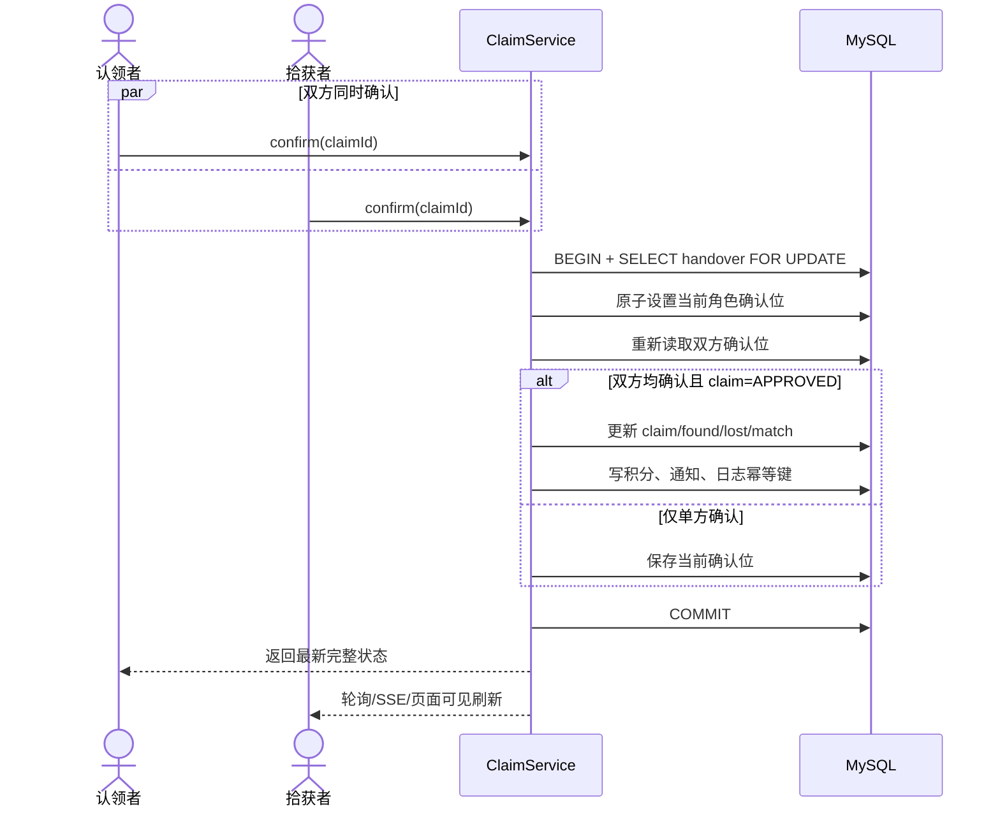

不能依赖前端按钮防抖解决并发；前端防重只改善体验，数据库约束和事务才保证正确性。

## 11. 管理员举报处置泳道

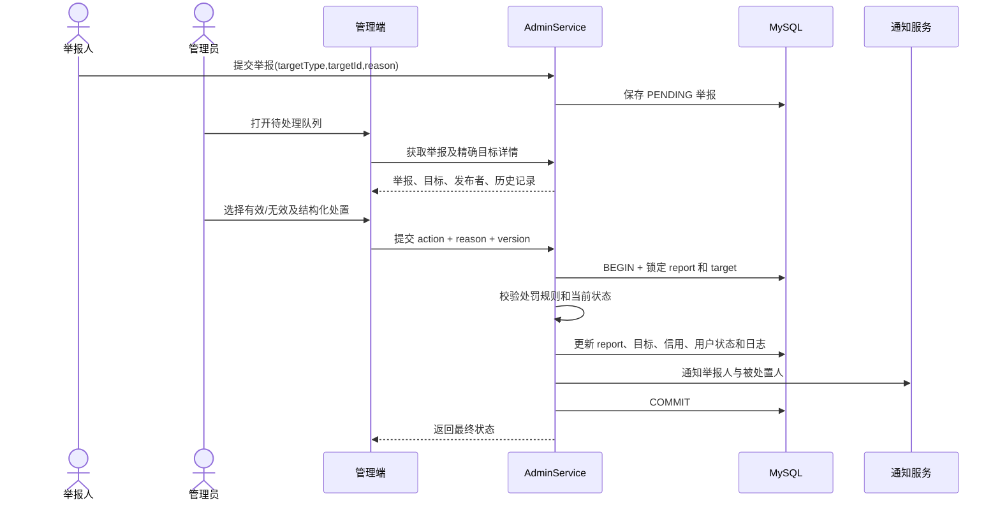

管理端不得依赖“在普通列表中人工寻找目标”。每个待办必须有精确目标详情、当前版本和完成后的可审计结果。

## 12. 页面交互状态规范

所有读请求页面至少实现四态，所有写操作至少实现六态。

### 12.1 读请求四态

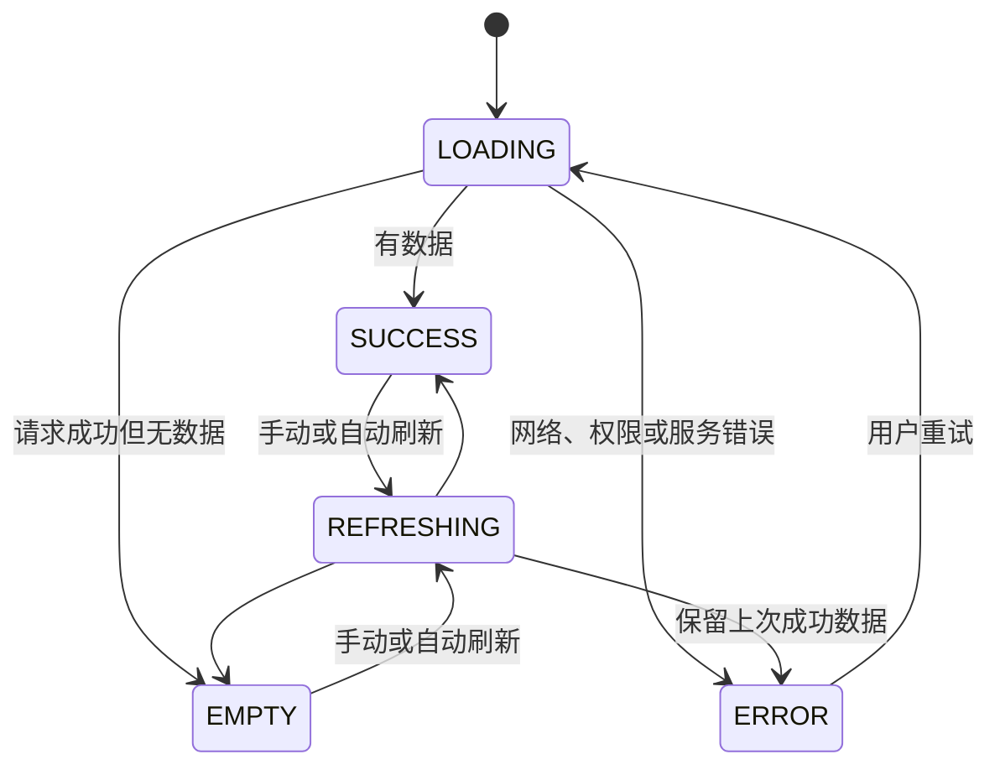

### 12.2 写操作六态

| 状态 | 页面行为 |
| --- | --- |
| IDLE | 可编辑、可提交 |
| VALIDATING | 展示字段级错误，不发送请求 |
| SUBMITTING | 禁用同一业务对象的全部冲突操作 |
| SUCCEEDED | 展示结果，并刷新相关实体/角标/列表 |
| FAILED_RETRYABLE | 保留输入，说明是否可能已成功，提供查询或安全重试 |
| CONFLICT | 显示“状态已被其他操作改变”，拉取最新数据，不盲目覆盖 |

通用页面规则：

- “暂无数据”只能用于成功的空响应，不能吞掉异常。
- 错误信息至少包含可读原因和 request ID。
- 上传中禁止提交依赖该资产的业务表单。
- 列表筛选、页码、排序写入 route query。
- 高影响操作显示目标、当前状态、目标状态和连带影响，再二次确认。
- 每个异步写函数和后端接口都必须可抵抗重复提交。

## 13. 通知深链契约

| relatedType | 目标页面 | 必要上下文 | 无权/已失效时的反馈 |
| --- | --- | --- | --- |
| MATCH | `/matches/:matchId` | `matchId`、方向、双方物品 ID | 显示匹配已失效，不强制登出 |
| CLAIM | `/claims/:claimId` | `claimId`、当前用户角色 | 显示当前状态和可执行动作 |
| LOST | `/items/lost/:id` | 来源通知 ID | 记录关闭时显示终态详情 |
| FOUND | `/items/found/:id` | 可选 `matchId` | 敏感图按权限返回展示资产 |
| CERT | `/profile/certification` | 申请 ID 可选 | 显示审核意见 |
| REPORT | 用户端举报结果页或消息详情 | `reportId` | 无独立页面时不要伪装成可点击链接 |
| ANNOUNCEMENT | `/announcements/:id` | `announcementId` | 下线后显示已下线说明 |

通知点击应先导航再在目标页处理已读，或保证标记已读失败不阻断导航。

## 14. 需求追踪矩阵

| 需求 | 页面入口 | 关键 API/服务 | 核心状态 | 必须测试 |
| --- | --- | --- | --- | --- |
| P0-01 登录 | 登录/注册 | auth、UserService | user ACTIVE/DISABLED | 密码登录、OTP 一次性、禁用、网络恢复 |
| P0-02 认证 | 认证页、认证队列 | certification、AdminService | cert PENDING/APPROVED/REJECTED | 重复提交、并发审批、旧申请 |
| P0-03/04 发布 | 两类发布页 | ItemService、asset、outbox | lost SEARCHING、found PENDING | 上传失败、AI 超时、任务投递 |
| P0-05 搜索 | 搜索页 | item repository | review + business status | 类别、状态、地点、时间、排序、URL 恢复 |
| P0-06 匹配 | 匹配页、通知 | MatchService、AI | NEW/READ/CLAIMED/EXPIRED | 自动触发、重复 pair、低分失效、深链 |
| P0-07 认领 | 详情/匹配认领弹窗 | ClaimService | claim 状态机 | 空答案、错误答案、越权 match、并发认领 |
| P0-08 交接 | 认领详情 | ClaimService、CreditService | handover + 三实体结案 | 顺序/并发确认、重复确认、事务回滚 |
| P0-09 通知 | 消息中心、角标 | NotificationService | READ/UNREAD | MATCH 深链、订阅、停留刷新 |
| P0-10 后台 | 审核/举报详情 | AdminService | review/report 状态 | 目标定位、CAS、下架、处罚、日志 |

## 15. 交互逻辑评审清单

每增加一个按钮、接口或状态时，评审必须逐项回答：

- 操作者角色和资源所有权是什么？
- 哪些源状态允许该操作？
- 目标状态是否在权威枚举中？
- 是否需要锁、CAS、唯一约束或幂等键？
- 同一事务内必须更新哪些关联实体？
- 需要发送哪些通知、积分和操作日志？
- 重复提交返回什么？
- 并发状态变化返回什么？
- AI/网络失败时是降级、重试、人工复核还是整体失败？
- 前端如何展示 loading、empty、error、success 和 conflict？
- 通知或外部深链如何恢复上下文？
- 哪个自动化测试证明正常、异常和并发分支？

只有状态迁移表、实现和测试三者一致，才应在验收清单中标记为完成。
